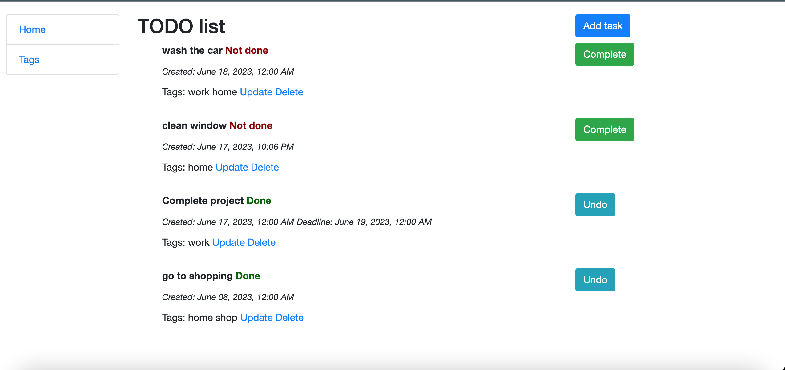

# TODO-list
The TODO list is a site that provides ability to create task, update, and delete tasks. 
With the TODO list can easily set dedlines for the tasks and change status of task to Complete if a task is not done or Undo if a task is done.
Also a task can have multiple tags.


```shell
git clone https://github.com/kleotan901/todo-list.git
cd todo-list
python3 -m venv venv
source venv/bin/activate
pip install -r requirements.txt
python3 manage.py migrate
python3 manage.py runserver #stsrts Django Server
```


## Configuration

The project uses environment variables for configuration. Please follow these steps to set up the required configuration files.


### `.env` and `.env_sample` File

The .env file is used to store sensitive information and configuration variables that are necessary for the project to function properly.

The .env_sample file serves as a template or example for the .env file. It includes the necessary variables and their expected format, but with placeholder values.
 
 To configure the project:

- Locate the .env_sample file in the project's root directory.
- Duplicate the .env_sample file and rename the duplicated file to .env.
- Open the .env file and replace the placeholder values with the actual configuration values specific to your setup.

Remember to keep the .env file secure and avoid sharing it publicly or committing it to version control systems.

## Demo

